# Figure 1
Analysis of 11 data sets with published precomputed FPKM/RPKM values for brain, heart and kidney samples from four different studies.

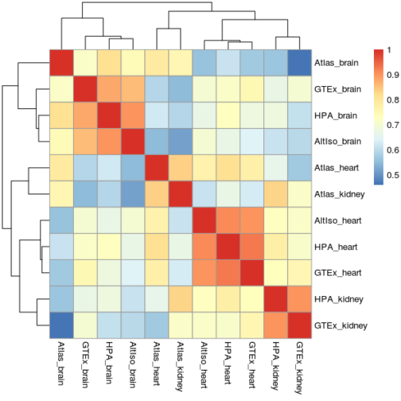

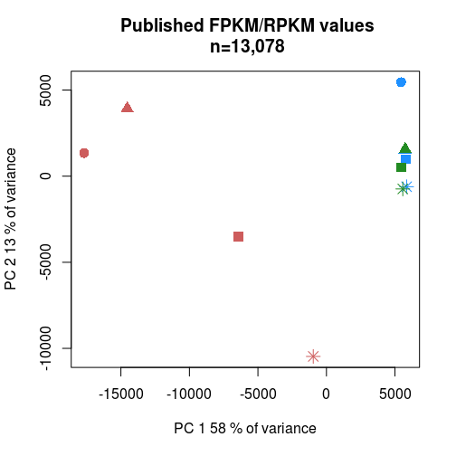

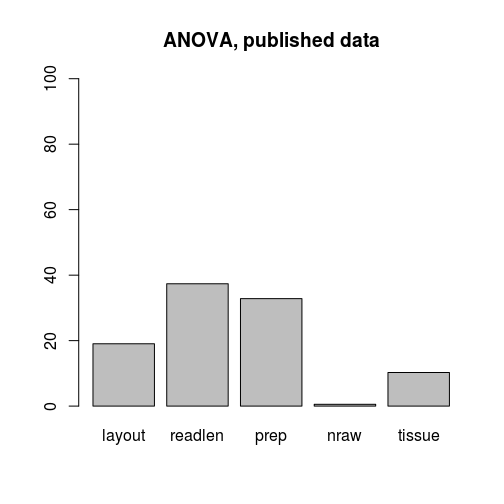

# Figure 2

Analysis of log-transformed published precomputed FPKM/RPKM values for brain heart and kidney samples from four different studies.

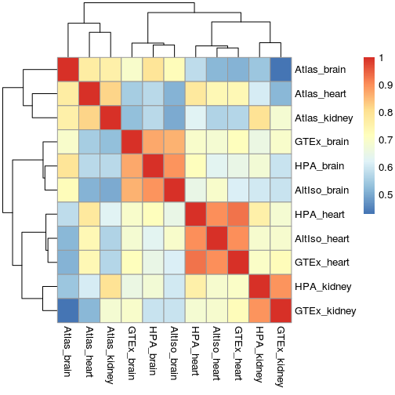

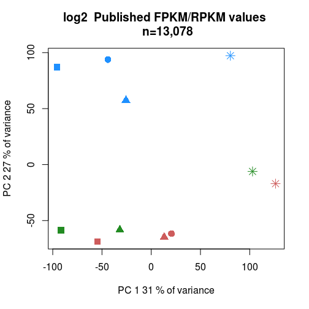

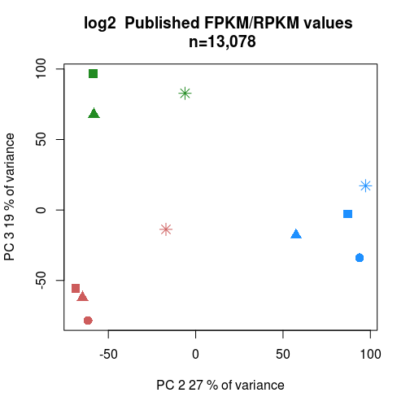

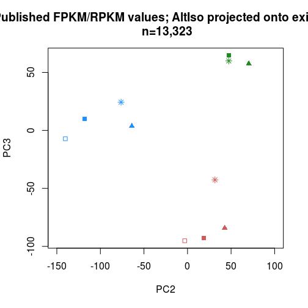

# Figure 3

Analysis of precomputed FPKM/RPKM values for brain, heart and kidney samples from four different studies after removal of batch effects using ComBat.

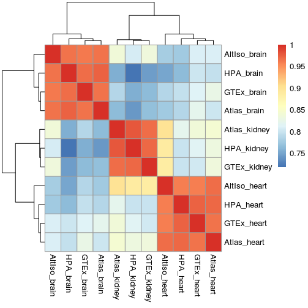

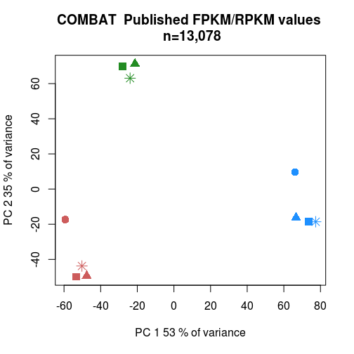

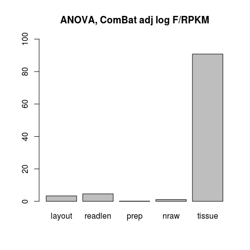

# Figure 4

Analysis of Cufflinks FPKM values after reprocessing from FASTQ files.

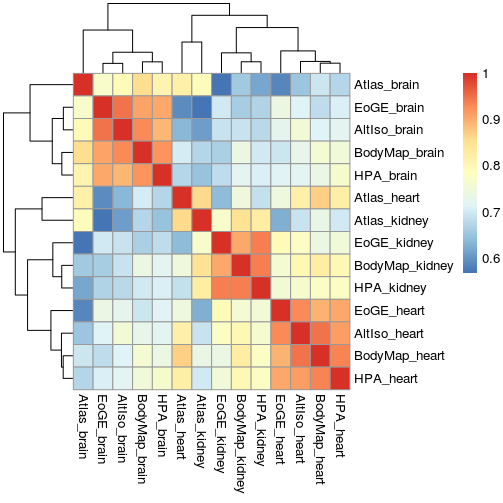

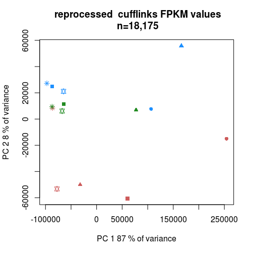

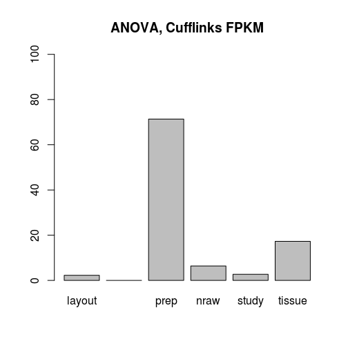

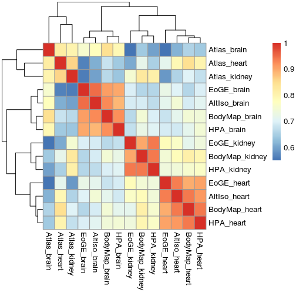

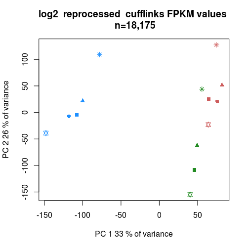

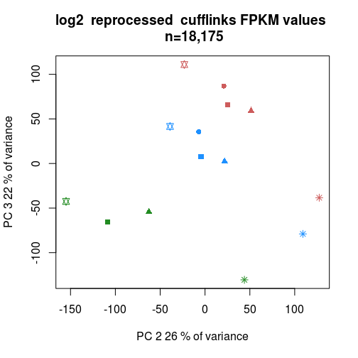

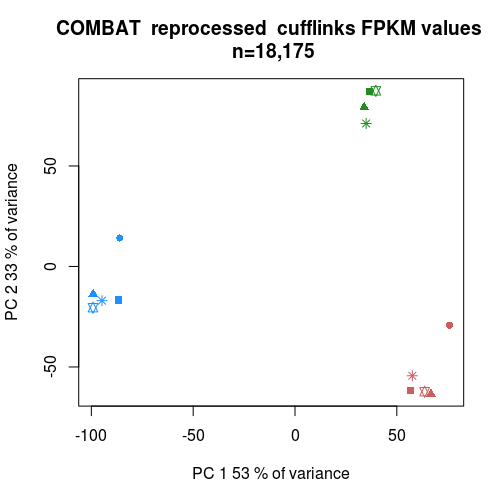

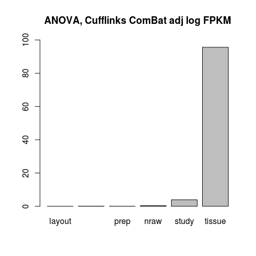

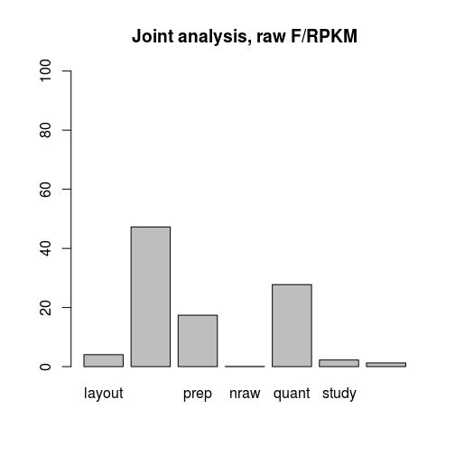

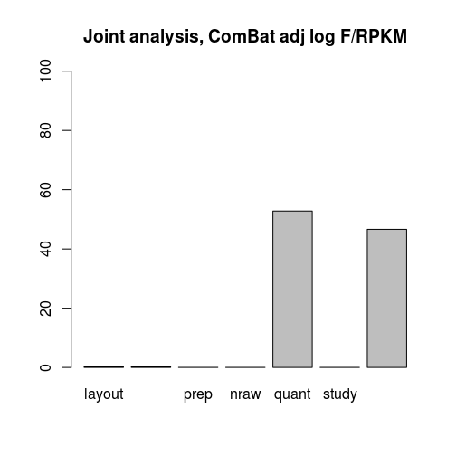
